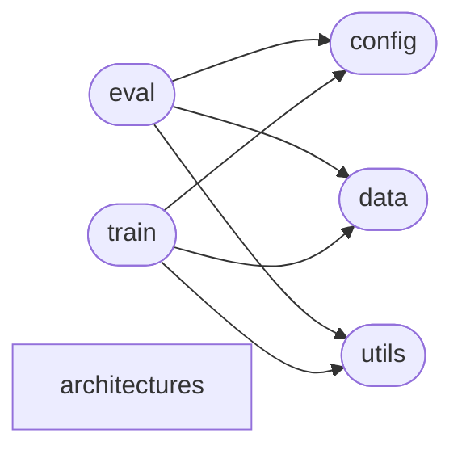

# Code Overview

[_Documentation generated by Documatic_](https://www.documatic.com)

<!---Documatic-section-Codebase Structure Python-start--->
## Codebase Structure Python

The codebase has a single-depth folder structure,
                with 9 code files in total.

<!---Documatic-block-system_architecture-start--->

<!---Documatic-block-system_architecture-end--->

# #
<!---Documatic-section-Codebase Structure Python-end--->

<!---Documatic-section-Important Functions-start--->
## Important Functions

<!---Documatic-block-important_funcs-start--->
<!---Documatic-block-most_used_funcs-start--->
### Most Utilised Functions

* [neat.utils.iou](4-neat_utils.md#neat.utils.iou) (2 times)
* [neat.utils.flow_to_color](4-neat_utils.md#neat.utils.flow_to_color) (1 times)
<!---Documatic-block-most_used_funcs-end--->
<!---Documatic-block-important_funcs-end--->

# #
<!---Documatic-section-Important Functions-end--->

<!---Documatic-section-File IO-start--->
## File IO

<!---Documatic-block-file_io-start--->
The following files have file read operations

<!---Documatic-block-neat-start--->

	
<code>neat</code> (Click to Expand!)

* neat.data
* neat.train

<!---Documatic-block-neat-end--->

The following files have file write operations

<!---Documatic-block-neat-start--->

	
<code>neat</code> (Click to Expand!)

* neat.train

<!---Documatic-block-neat-end--->
<!---Documatic-block-file_io-end--->

# #
<!---Documatic-section-File IO-end--->

<!---Documatic-section-Class Hierarchy-start--->
## Class Hierarchy

<!---Documatic-block-Dataset-start--->

	
<code>Dataset</code> (Click to Expand!)

* neat.data.CARLA_points

<!---Documatic-block-Dataset-end--->

<!---Documatic-block-nn.Module-start--->

	
<code>nn.Module</code> (Click to Expand!)

* neat.architectures.__init__.AttentionField
* neat.architectures.decoder.CBatchNorm1d
* neat.architectures.decoder.Decoder
* neat.architectures.decoder.ResnetBlockFC
* neat.architectures.encoder.Block
* neat.architectures.encoder.Encoder
* neat.architectures.encoder.SelfAttention

<!---Documatic-block-nn.Module-end--->

<!---Documatic-block-object-start--->

	
<code>object</code> (Click to Expand!)

* neat.architectures.controller.PIDController
* neat.train.Engine

<!---Documatic-block-object-end--->

# #
<!---Documatic-section-Class Hierarchy-end--->

[_Documentation generated by Documatic_](https://www.documatic.com)