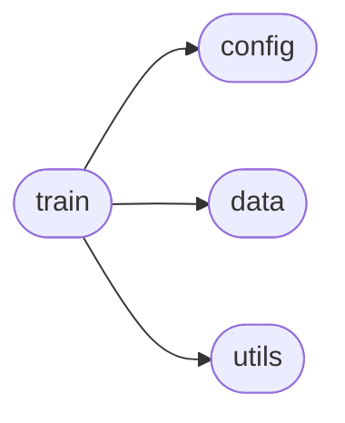
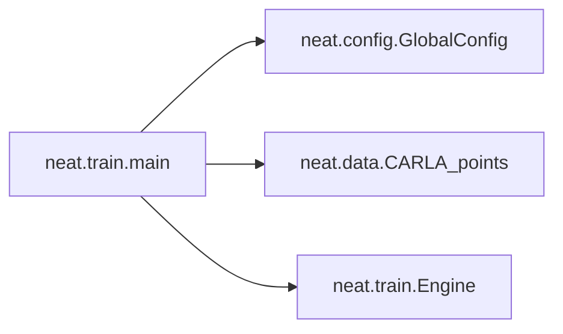

# Neat Train

[_Documentation generated by Documatic_](https://www.documatic.com)

<!---Documatic-section-Codebase Structure-start--->
## Codebase Structure

<!---Documatic-block-system_architecture-start--->

<!---Documatic-block-system_architecture-end--->

# #
<!---Documatic-section-Codebase Structure-end--->

<!---Documatic-section-neat.train.main-start--->
## [neat.train.main](5-neat_train.md#neat.train.main)

<!---Documatic-section-main-start--->


### Object Calls

* neat.config.GlobalConfig
* neat.data.CARLA_points
* neat.train.Engine

<!---Documatic-block-neat.train.main-start--->
<details>
	<summary><code>neat.train.main</code> code snippet</summary>

```python
def main():
    args = parser.parse_args()
    args.logdir = os.path.join(args.logdir, args.id)
    if not os.path.isdir(args.logdir):
        os.makedirs(args.logdir)
        print('Created dir:', args.logdir)
    conf = GlobalConfig()
    train_set = CARLA_points(conf.train_data, conf)
    val_set = CARLA_points(conf.val_data, conf)
    dataloader_train = DataLoader(train_set, batch_size=args.batch_size, shuffle=True, num_workers=args.workers, pin_memory=True)
    dataloader_val = DataLoader(val_set, batch_size=args.batch_size, shuffle=False, num_workers=args.workers, pin_memory=True)
    model = AttentionField(conf, args.device)
    parameters = list(model.encoder.parameters()) + list(model.decoder.parameters())
    optimizer = optim.AdamW(parameters, lr=conf.lr)
    trainer = Engine(conf)
    if os.path.isdir(args.logdir):
        logfile = os.path.join(args.logdir, 'recent.log')
        if os.path.isfile(logfile):
            print('Loading checkpoint from ' + args.logdir)
            with open(logfile, 'r') as f:
                log_table = json.load(f)
            trainer.cur_epoch = log_table['epoch']
            trainer.bestval = log_table['bestval']
            trainer.train_loss = log_table['train_loss']
            trainer.val_loss = log_table['val_loss']
            model.encoder.load_state_dict(torch.load(os.path.join(args.logdir, 'encoder.pth')))
            model.decoder.load_state_dict(torch.load(os.path.join(args.logdir, 'decoder.pth')))
            optimizer.load_state_dict(torch.load(os.path.join(args.logdir, 'recent_optim.pth')))
    with open(os.path.join(args.logdir, 'args.txt'), 'w') as f:
        json.dump(args.__dict__, f, indent=2)
    for epoch in range(trainer.cur_epoch, args.epochs):
        trainer.train(optimizer, model, args, dataloader_train)
        if epoch % args.val_every == 0:
            trainer.validate(model, args, dataloader_val)
            trainer.save(optimizer, model, args)
```
</details>
<!---Documatic-block-neat.train.main-end--->
<!---Documatic-section-main-end--->

# #
<!---Documatic-section-neat.train.main-end--->

[_Documentation generated by Documatic_](https://www.documatic.com)