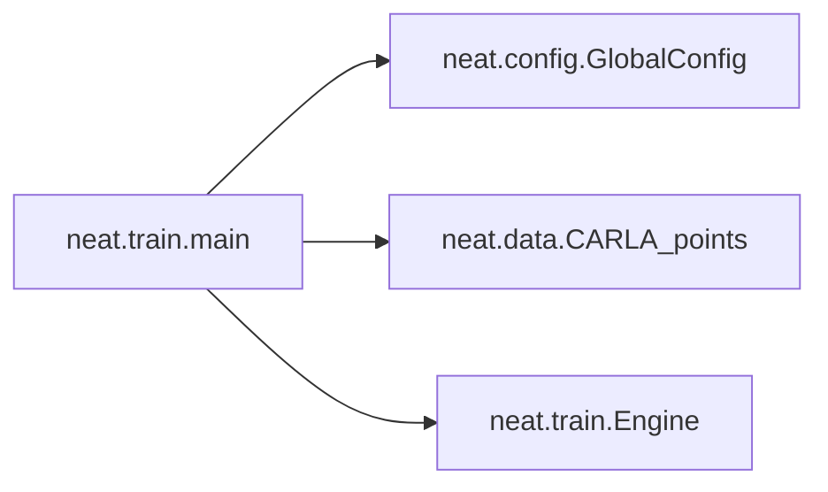

# Key Objects

[_Documentation generated by Documatic_](https://www.documatic.com)

<!---Documatic-section-neat.utils.iou-start--->
## neat.utils.iou

<!---Documatic-section-iou-start--->
<!---Documatic-block-neat.utils.iou-start--->
<details>
	<summary><code>neat.utils.iou</code> code snippet</summary>

```python
def iou(points1: torch.Tensor, points2: torch.Tensor):
    points1 = points1.view(-1).byte()
    points2 = points2.view(-1).byte()
    assert points1.shape == points2.shape, 'points1 and points2 must have the same shape'
    intersection = torch.sum(torch.mul(points1, points2).float())
    union = torch.sum((points1 + points2).clamp(min=0, max=1).float())
    return (intersection, union)
```
</details>
<!---Documatic-block-neat.utils.iou-end--->
<!---Documatic-section-iou-end--->

# #
<!---Documatic-section-neat.utils.iou-end--->

<!---Documatic-section-neat.data.scale_and_crop_image-start--->
## neat.data.scale_and_crop_image

<!---Documatic-section-scale_and_crop_image-start--->
<!---Documatic-block-neat.data.scale_and_crop_image-start--->
<details>
	<summary><code>neat.data.scale_and_crop_image</code> code snippet</summary>

```python
def scale_and_crop_image(filename, scale, crop):
    image = Image.open(filename)
    (width, height) = (int(image.width / scale), int(image.height / scale))
    if scale != 1:
        im_resized = image.resize((width, height))
    else:
        im_resized = image
    image = np.asarray(im_resized)
    start_y = height // 2 - crop // 2
    start_x = width // 2 - crop // 2
    cropped_image = image[start_y:start_y + crop, start_x:start_x + crop]
    if len(cropped_image.shape) == 2:
        cropped_image = cropped_image.reshape((crop, crop, 1))
    cropped_image = np.transpose(cropped_image, (2, 0, 1))
    return cropped_image
```
</details>
<!---Documatic-block-neat.data.scale_and_crop_image-end--->
<!---Documatic-section-scale_and_crop_image-end--->

# #
<!---Documatic-section-neat.data.scale_and_crop_image-end--->

<!---Documatic-section-neat.architectures.encoder.normalize_imagenet-start--->
## neat.architectures.encoder.normalize_imagenet

<!---Documatic-section-normalize_imagenet-start--->
<!---Documatic-block-neat.architectures.encoder.normalize_imagenet-start--->
<details>
	<summary><code>neat.architectures.encoder.normalize_imagenet</code> code snippet</summary>

```python
def normalize_imagenet(x):
    x = x.clone()
    x[:, 0] = (x[:, 0] - 0.485) / 0.229
    x[:, 1] = (x[:, 1] - 0.456) / 0.224
    x[:, 2] = (x[:, 2] - 0.406) / 0.225
    return x
```
</details>
<!---Documatic-block-neat.architectures.encoder.normalize_imagenet-end--->
<!---Documatic-section-normalize_imagenet-end--->

# #
<!---Documatic-section-neat.architectures.encoder.normalize_imagenet-end--->

<!---Documatic-section-neat.utils.make_colorwheel-start--->
## neat.utils.make_colorwheel

<!---Documatic-section-make_colorwheel-start--->
<!---Documatic-block-neat.utils.make_colorwheel-start--->
<details>
	<summary><code>neat.utils.make_colorwheel</code> code snippet</summary>

```python
def make_colorwheel():
    RY = 15
    YG = 6
    GC = 4
    CB = 11
    BM = 13
    MR = 6
    ncols = RY + YG + GC + CB + BM + MR
    colorwheel = np.zeros((ncols, 3))
    col = 0
    colorwheel[0:RY, 0] = 255
    colorwheel[0:RY, 1] = np.floor(255 * np.arange(0, RY) / RY)
    col = col + RY
    colorwheel[col:col + YG, 0] = 255 - np.floor(255 * np.arange(0, YG) / YG)
    colorwheel[col:col + YG, 1] = 255
    col = col + YG
    colorwheel[col:col + GC, 1] = 255
    colorwheel[col:col + GC, 2] = np.floor(255 * np.arange(0, GC) / GC)
    col = col + GC
    colorwheel[col:col + CB, 1] = 255 - np.floor(255 * np.arange(CB) / CB)
    colorwheel[col:col + CB, 2] = 255
    col = col + CB
    colorwheel[col:col + BM, 2] = 255
    colorwheel[col:col + BM, 0] = np.floor(255 * np.arange(0, BM) / BM)
    col = col + BM
    colorwheel[col:col + MR, 2] = 255 - np.floor(255 * np.arange(MR) / MR)
    colorwheel[col:col + MR, 0] = 255
    return colorwheel
```
</details>
<!---Documatic-block-neat.utils.make_colorwheel-end--->
<!---Documatic-section-make_colorwheel-end--->

# #
<!---Documatic-section-neat.utils.make_colorwheel-end--->

<!---Documatic-section-neat.train.main-start--->
## neat.train.main

<!---Documatic-section-main-start--->


### Object Calls

* neat.config.GlobalConfig
* neat.data.CARLA_points
* neat.train.Engine

<!---Documatic-block-neat.train.main-start--->
<details>
	<summary><code>neat.train.main</code> code snippet</summary>

```python
def main():
    args = parser.parse_args()
    args.logdir = os.path.join(args.logdir, args.id)
    if not os.path.isdir(args.logdir):
        os.makedirs(args.logdir)
        print('Created dir:', args.logdir)
    conf = GlobalConfig()
    train_set = CARLA_points(conf.train_data, conf)
    val_set = CARLA_points(conf.val_data, conf)
    dataloader_train = DataLoader(train_set, batch_size=args.batch_size, shuffle=True, num_workers=args.workers, pin_memory=True)
    dataloader_val = DataLoader(val_set, batch_size=args.batch_size, shuffle=False, num_workers=args.workers, pin_memory=True)
    model = AttentionField(conf, args.device)
    parameters = list(model.encoder.parameters()) + list(model.decoder.parameters())
    optimizer = optim.AdamW(parameters, lr=conf.lr)
    trainer = Engine(conf)
    if os.path.isdir(args.logdir):
        logfile = os.path.join(args.logdir, 'recent.log')
        if os.path.isfile(logfile):
            print('Loading checkpoint from ' + args.logdir)
            with open(logfile, 'r') as f:
                log_table = json.load(f)
            trainer.cur_epoch = log_table['epoch']
            trainer.bestval = log_table['bestval']
            trainer.train_loss = log_table['train_loss']
            trainer.val_loss = log_table['val_loss']
            model.encoder.load_state_dict(torch.load(os.path.join(args.logdir, 'encoder.pth')))
            model.decoder.load_state_dict(torch.load(os.path.join(args.logdir, 'decoder.pth')))
            optimizer.load_state_dict(torch.load(os.path.join(args.logdir, 'recent_optim.pth')))
    with open(os.path.join(args.logdir, 'args.txt'), 'w') as f:
        json.dump(args.__dict__, f, indent=2)
    for epoch in range(trainer.cur_epoch, args.epochs):
        trainer.train(optimizer, model, args, dataloader_train)
        if epoch % args.val_every == 0:
            trainer.validate(model, args, dataloader_val)
            trainer.save(optimizer, model, args)
```
</details>
<!---Documatic-block-neat.train.main-end--->
<!---Documatic-section-main-end--->

# #
<!---Documatic-section-neat.train.main-end--->

<!---Documatic-section-neat.utils.flow_uv_to_colors-start--->
## neat.utils.flow_uv_to_colors

<!---Documatic-section-flow_uv_to_colors-start--->


### Object Calls

* neat.utils.make_colorwheel

<!---Documatic-block-neat.utils.flow_uv_to_colors-start--->
<details>
	<summary><code>neat.utils.flow_uv_to_colors</code> code snippet</summary>

```python
def flow_uv_to_colors(u, v, convert_to_bgr=False):
    flow_image = np.zeros((u.shape[0], u.shape[1], 3), np.uint8)
    colorwheel = make_colorwheel()
    ncols = colorwheel.shape[0]
    rad = np.sqrt(np.square(u) + np.square(v))
    a = np.arctan2(-v, -u) / np.pi
    fk = (a + 1) / 2 * (ncols - 1)
    k0 = np.floor(fk).astype(np.int32)
    k1 = k0 + 1
    k1[k1 == ncols] = 0
    f = fk - k0
    for i in range(colorwheel.shape[1]):
        tmp = colorwheel[:, i]
        col0 = tmp[k0] / 255.0
        col1 = tmp[k1] / 255.0
        col = (1 - f) * col0 + f * col1
        idx = rad <= 1
        col[idx] = 1 - rad[idx] * (1 - col[idx])
        col[~idx] = col[~idx] * 0.75
        ch_idx = 2 - i if convert_to_bgr else i
        flow_image[:, :, ch_idx] = np.floor(255 * col)
    return flow_image
```
</details>
<!---Documatic-block-neat.utils.flow_uv_to_colors-end--->
<!---Documatic-section-flow_uv_to_colors-end--->

# #
<!---Documatic-section-neat.utils.flow_uv_to_colors-end--->

<!---Documatic-section-neat.data.semantics_to_points-start--->
## neat.data.semantics_to_points

<!---Documatic-section-semantics_to_points-start--->


### Object Calls

* neat.data.transform_2d_points

<!---Documatic-block-neat.data.semantics_to_points-start--->
<details>
	<summary><code>neat.data.semantics_to_points</code> code snippet</summary>

```python
def semantics_to_points(full_semantics, i, seq_theta, seq_x, seq_y, ego_theta, ego_x, ego_y, num_class, converter, crop, axis, resolution, offset):
    converter = np.uint8(converter)
    full_semantics = converter[full_semantics]
    points_all = []
    for k in range(num_class):
        points_k = np.array(np.where(full_semantics == k))
        points_k[0] = i
        points_k[1] = (points_k[1] - crop // 2) * resolution
        points_k[2] = (points_k[2] - crop // 2) * resolution
        points_k = np.array(points_k[::-1, :]).T
        if points_k.shape[0] > 0:
            points_k = transform_2d_points(points_k, -np.pi / 2 - seq_theta[i], seq_x[i], seq_y[i], -np.pi / 2 - ego_theta, ego_x, ego_y)
        points_k = points_k[abs(points_k[:, 0]) < axis / 2 * resolution]
        points_k[:, 1] = points_k[:, 1] + offset * resolution
        points_k = points_k[abs(points_k[:, 1]) < axis / 2 * resolution]
        points_all.append(points_k)
    return points_all
```
</details>
<!---Documatic-block-neat.data.semantics_to_points-end--->
<!---Documatic-section-semantics_to_points-end--->

# #
<!---Documatic-section-neat.data.semantics_to_points-end--->

<!---Documatic-section-neat.utils.flow_to_color-start--->
## neat.utils.flow_to_color

<!---Documatic-section-flow_to_color-start--->


### Object Calls

* neat.utils.flow_uv_to_colors

<!---Documatic-block-neat.utils.flow_to_color-start--->
<details>
	<summary><code>neat.utils.flow_to_color</code> code snippet</summary>

```python
def flow_to_color(flow_uv, clip_flow=None, convert_to_bgr=False):
    assert flow_uv.ndim == 3, 'input flow must have three dimensions'
    assert flow_uv.shape[2] == 2, 'input flow must have shape [H,W,2]'
    if clip_flow is not None:
        flow_uv = np.clip(flow_uv, 0, clip_flow)
    u = flow_uv[:, :, 0]
    v = flow_uv[:, :, 1]
    rad = np.sqrt(np.square(u) + np.square(v))
    rad_max = np.max(rad)
    epsilon = 1e-05
    u = u / (rad_max + epsilon)
    v = v / (rad_max + epsilon)
    return flow_uv_to_colors(u, v, convert_to_bgr)
```
</details>
<!---Documatic-block-neat.utils.flow_to_color-end--->
<!---Documatic-section-flow_to_color-end--->

# #
<!---Documatic-section-neat.utils.flow_to_color-end--->

<!---Documatic-section-neat.data.transform_2d_points-start--->
## neat.data.transform_2d_points

<!---Documatic-section-transform_2d_points-start--->
<!---Documatic-block-neat.data.transform_2d_points-start--->
<details>
	<summary><code>neat.data.transform_2d_points</code> code snippet</summary>

```python
def transform_2d_points(xyz, r1, t1_x, t1_y, r2, t2_x, t2_y):
    xy1 = xyz.copy()
    xy1[:, 2] = 1
    (c, s) = (np.cos(r1), np.sin(r1))
    r1_to_world = np.matrix([[c, s, t1_x], [-s, c, t1_y], [0, 0, 1]])
    world = np.asarray(r1_to_world @ xy1.T)
    (c, s) = (np.cos(r2), np.sin(r2))
    r2_to_world = np.matrix([[c, s, t2_x], [-s, c, t2_y], [0, 0, 1]])
    world_to_r2 = np.linalg.inv(r2_to_world)
    out = np.asarray(world_to_r2 @ world).T
    out[:, 2] = xyz[:, 2]
    return out
```
</details>
<!---Documatic-block-neat.data.transform_2d_points-end--->
<!---Documatic-section-transform_2d_points-end--->

# #
<!---Documatic-section-neat.data.transform_2d_points-end--->

[_Documentation generated by Documatic_](https://www.documatic.com)